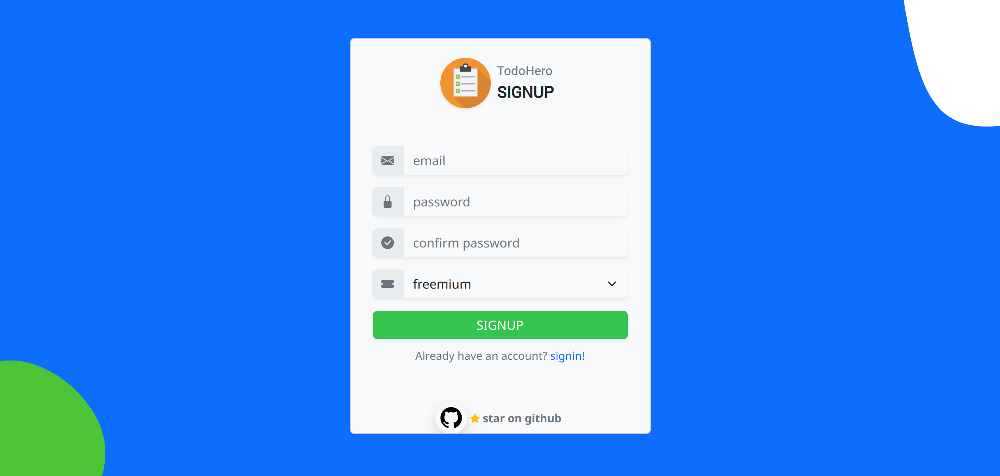
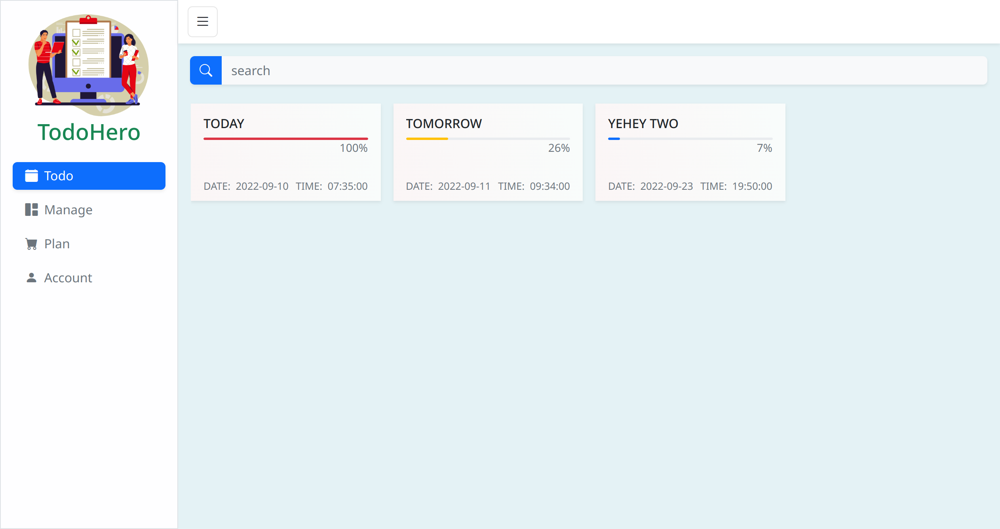

# TodoHero App
Simple todo organizer web application.


## COMPONENTS :camera:
- [X] ADMIN Page
- [x] TodoHero App
    - Todo List
    - Todo Manager
    - Plan Manager
    - Account Manager

- [x] Online Payment
    - Stripe Payment Gateway
- [x] Email Notification


## CHANGES
```php

    echo "hola!";

```


## SAMPLE IMAGES :camera:
- REGULAR VIEW
<p align="left">
    
    
    
    
    
    
    
</p>