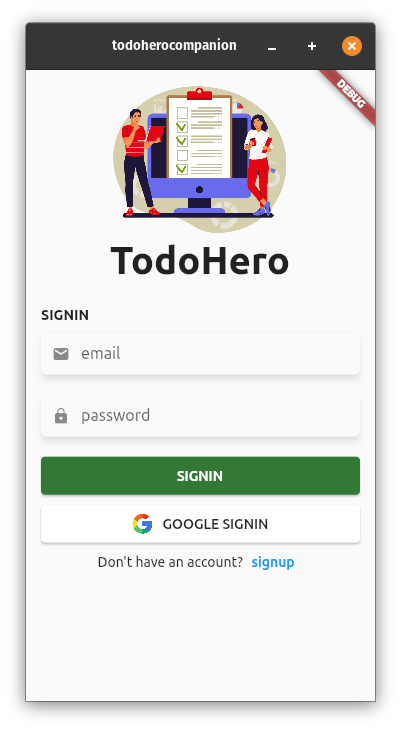
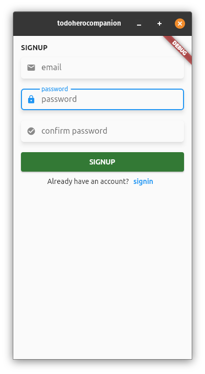
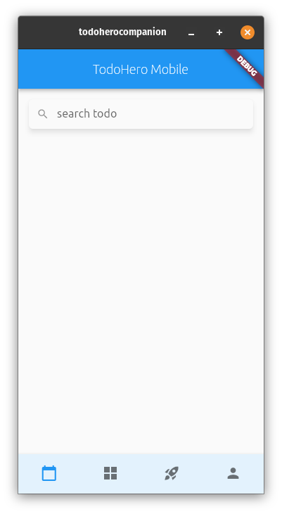
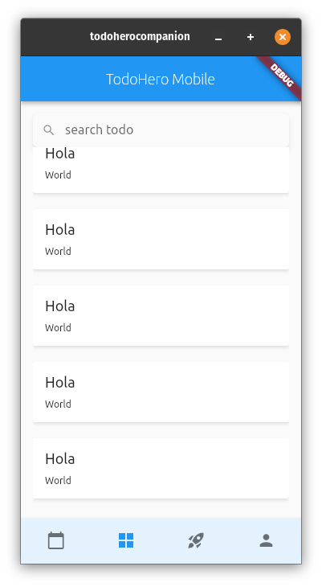
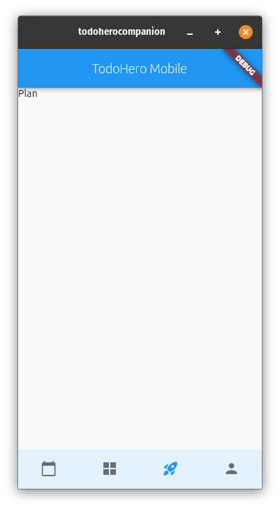
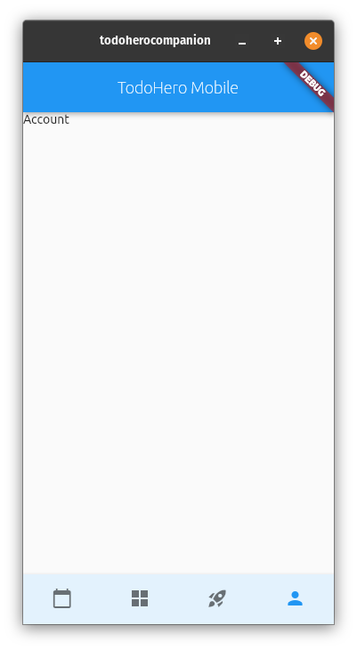

# TodoHero App
Simple todo organizer web application.


## COMPONENTS :fire:
- [X] ADMIN Page
- [x] TodoHero App
    - Todo List
    - Todo Manager
    - Plan Manager
    - Account Manager

- [x] Online Payment
    - Stripe Payment Gateway
- [x] Email Notification


## ADDED MOBILE APP COMPANION
- [X] SIGNIN
- [X] SIGNUP
- [X] MANAGEMENT PAGE(semi finished)
- [X] TODO PAGE(semi finished)
- [ ] PLAN PAGE(not yet finished)
- [ ] ACCOUNT PAGE(not yet finished)

## CHANGES
```php

    <?php

        // laravel-as-backend/app/Console/NotifyUser.php

        // OLD
        // $users = DB::table("user_todo_details")
        //     ->join("user", "user_todo_details.user_id_fk", "=", "user.user_id")
        //     ->join("todo", "user_todo_details.todo_id_fk", "=", "todo.todo_id")
        //     ->whereMonth("todo.date", "<=", DB::Raw("MONTH(CURRENT_DATE)"))
        //     ->whereDay("todo.date", "<=", DB::Raw("DAY(CURRENT_DATE)"))
        //     ->whereTime("todo.time", "<", DB::Raw("TIME(CURRENT_TIME)"))
        //     ->get();

        // NEW
        $users = UserTodoDetails::join("user", "user_todo_details.user_id_fk", "=", "user.user_id")
            ->join("todo", "user_todo_details.todo_id_fk", "=", "todo.todo_id")
            ->whereMonth("todo.date", "<=", DB::Raw("MONTH(CURRENT_DATE)"))
            ->whereDay("todo.date"  , "<=", DB::Raw("DAY(CURRENT_DATE)"))
            ->whereTime("todo.time" , "<" , DB::Raw("TIME(CURRENT_TIME)"))
            ->get();
        
    ?>

    <?php

        // laravel-as-backend/app/Console/UpdateExpired.php

        // OLD
        // Db::unprepared("
        //     UPDATE user_plan_details SET user_plan_details.plan_status_id_fk = 1
        //     WHERE (month(user_plan_details.date_validated) < month(CURRENT_DATE)) and
        //         ( year(user_plan_details.date_validated) = year (CURRENT_DATE)) and
        //         (user_plan_details.plan_status_id_fk = 2 and user_plan_details.plan_id_fk != 1);
        // ");

        // NEW
        UserPlanDetails::whereMonth("user_plan_details.date_validated", "<", DB::Raw("MONTH(CURRENT_DATE)"))
            ->whereYear("user_plan_details.date_validated", "=", DB::Raw("YEAR(CURRENT_DATE)"))
            ->where("user_plan_details.plan_status_id_fk", "=", "2")
            ->where("user_plan_details.plan_id_fk", "!=", "1")
            ->update([ "plan_status_id_fk" => 1 ]);

    ?>
```


## SAMPLE IMAGES :camera:

- REGULAR VIEW
<p align="left">
    
    
    
    
    
    
    
    
    
</p>
- SMALL DEVICES VIEW
<p align="left">
    
    
    
    
    
    
    
    
    
    
</p>


## ADMIN PAGE
<p align="left">
    
    
    
</p>

## MOBILE APP
<p align="left">
    
    
    
    
    
    
</p>